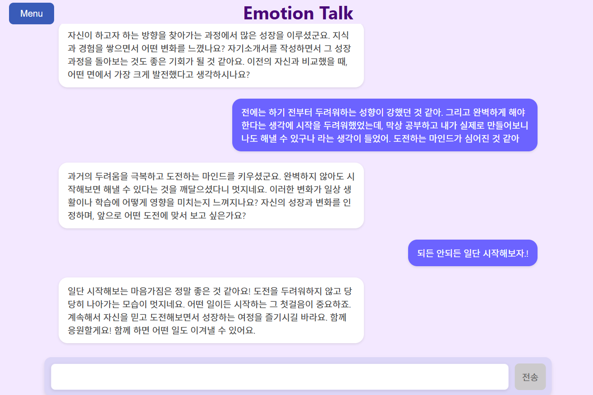
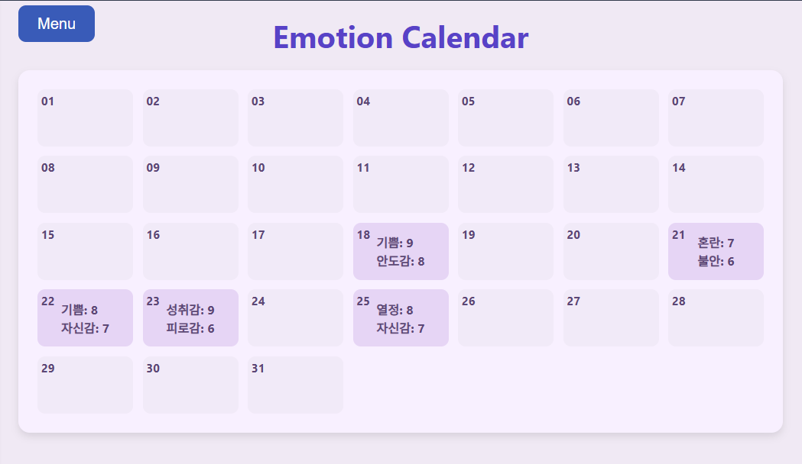
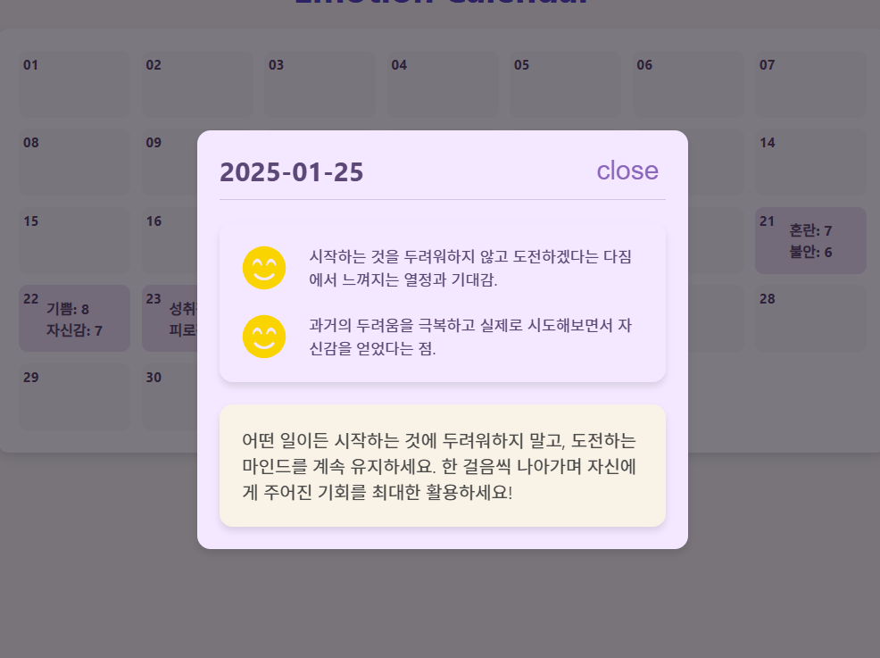

# 감정 기록 APP

  대화를 통해 감정을 기록하는 앱

  ## 기능
  ### 감정 대화 및 기록
  
  OPEN AI를 통한 대화
  
  월간 기록된 결과
  
  이유와 조언

  ### 심리 상담

## 정리
- [LEARN.md](./LEARN.md)
- [UPDATE.md](./UPDATE.md)

## 보완해야할 점
  ### api
  - transaction 처리

  ### firebase
  - firestore document의 특정 데이터만 사용하고 싶은데, document에 데이터가 너무 많은 경우
    - firebase는 document 데이터 전체를 가져오는 기능밖에 없기 때문에 속도가 느려질 수 있다.따라서 특정 document에 있는 데이터를 효과적으로 나누어 저장해야 한다.
    - 1. document name을 날짜로 변환하는 방법

  ### OPEN AI 
   PROMPT 개선할 사항
  - 사용자의 취향을 고려하여, ex. MBTI 등의 정보를 assistant에 전달하면 더욱 좋은 대화 가능.
  - 매번 동일한 레파토리로 대화를 진행하는 문제점 : prompt의 temperature를 조정.

  ### Modal 범용성
  UI가 Modal마다 달라서 각각의 다른 Modal Provider를 만들어야한다는 문제점
  - 고차함수를 이용해서 원하는 UI Modal을 반환해주는 ModalProvider를 만들면 해결 할 수 있다.

  ### chat message data
  - 이전 채팅 데이터를 가져올때, 매번 server에 요청해서 가져오는데, 이로인해 요청횟수가 많아질 수 있다. (갱신이 더욱 잘 된다는 장점은 있다)
  
  - 하지만 변경사항이 없는 한, 데이터가 바뀔 가능성은 없으므로 server에 요청하지 말고 redux state에 있는 messages 값을 가져오는 것이 더욱 효율적이다. 
